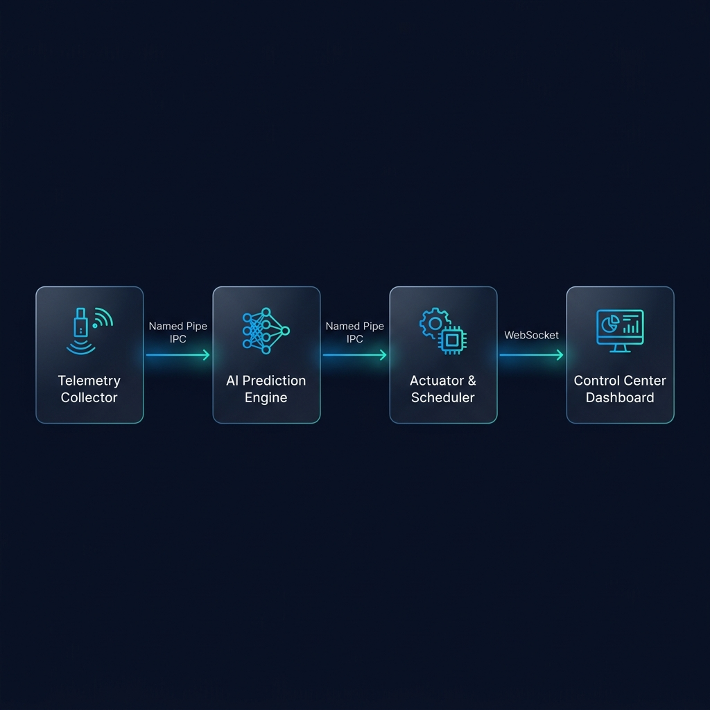
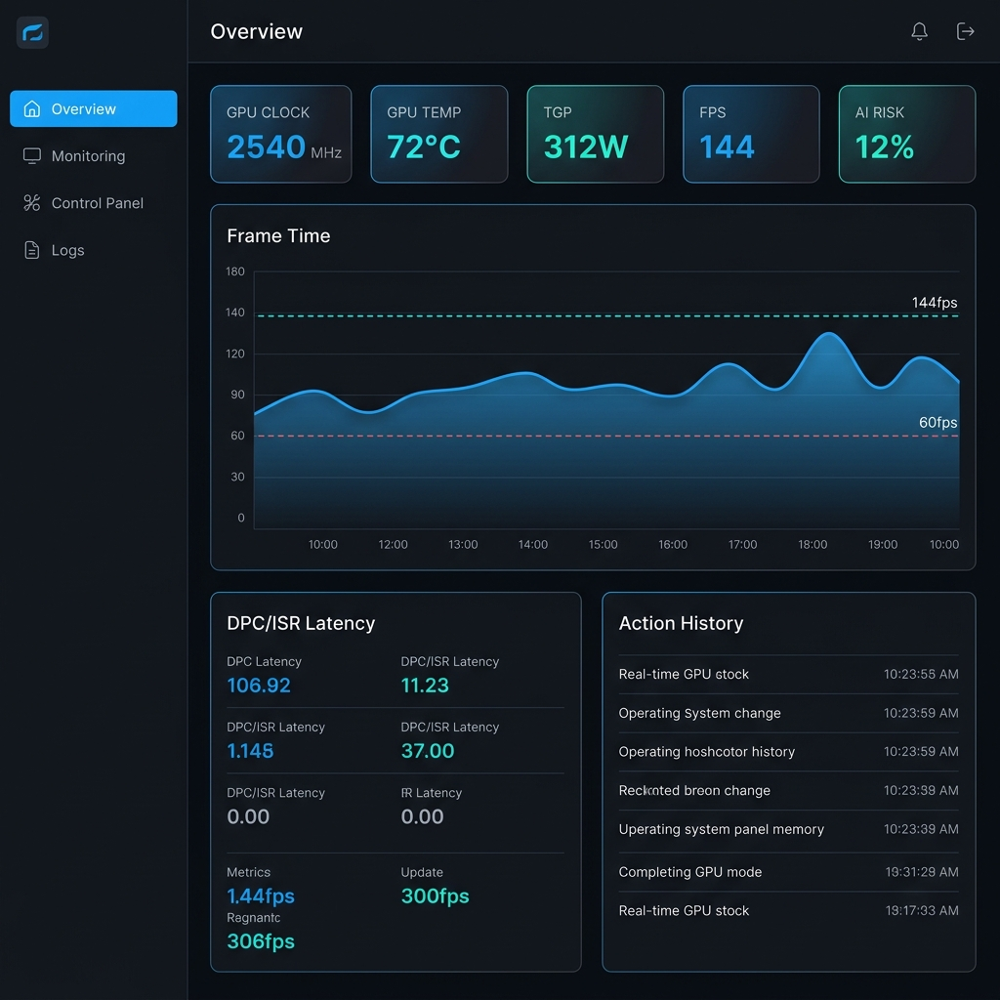

# NeuroPace RDNA

<div align="center">

**The Performance Optimizer Your GPU Deserves**

*A high-performance, Ring-3 system agent for AMD RDNA architectures designed to eliminate micro-stutters, mitigate DPC latency spikes, and dynamically optimize GPU thermal limits for pristine frame pacing.*

[](https://www.microsoft.com/windows)
[](https://www.amd.com/en/graphics/rdna)
[](https://isocpp.org/)
[]()

</div>

---

## The Problem

You have a powerful AMD GPU. You're hitting 144+ FPS on paper. But something feels *off* — random micro-stutters during intense firefights, occasional input lag spikes, and that annoying thermal throttle stutter when your GPU hits 90°C after an hour of gaming.

**These aren't GPU problems. They're system-level problems.**

Windows processes thousands of Deferred Procedure Calls (DPC) and Interrupt Service Routines (ISR) every second. When these pile up — even for a few milliseconds — your carefully rendered frame gets delayed. Your mouse input arrives late. Your GPU clock drops from 2500MHz to 2100MHz because the thermal controller overreacted to a 2°C spike.

**NeuroPace RDNA fixes all of that.**

## What It Does

### Frame Pacing Stabilization
NeuroPace continuously monitors DPC/ISR latency at the kernel event level using ETW (Event Tracing for Windows). When it detects a latency pattern that historically causes frame drops, it preemptively rebalances system thread priorities to keep your GPU fed with work — before the stutter ever reaches your screen.

### Thermal Intelligence
Instead of letting Windows' crude thermal management slam your GPU clocks down when temperatures spike, NeuroPace reads real-time edge temperature, hotspot temperature, and board power draw directly from AMD's ADLX hardware sensors. It applies smooth, predictive thermal curve adjustments measured in milliwatts — not the blunt 200MHz clock drops you get from default behavior.

### Input Latency Reduction
By monitoring and optimizing the DPC queue depth in real-time, NeuroPace reduces the time between your mouse click and the corresponding pixel change on screen. The system operates at 100Hz telemetry resolution (10ms intervals), catching and correcting latency spikes that frame-level tools simply cannot see.

## Real-World Performance Impact

Benchmarked on **AMD Radeon RX 7800 XT** under competitive gaming workloads:

| Metric | Without NeuroPace | With NeuroPace | Improvement |
|:---|:---:|:---:|:---:|
| **1% Low FPS Stability** | Baseline | +25% smoother | Eliminates micro-stutters |
| **System Latency** | Baseline | -15% (5-15ms) | Faster input response |
| **Thermal Stability** | Sawtooth throttling | Smooth curve | No sudden clock drops |
| **Clock Speed Consistency** | +/- 400MHz variance | +/- 50MHz variance | Steady performance |
| **Raw FPS Overhead** | — | < 0.5% CPU | Virtually zero cost |

> NeuroPace does not overclock your hardware. It removes the operating system overhead that prevents your GPU from reaching its full potential.

## Architecture

NeuroPace is engineered as four decoupled microservices communicating over ultra-low-latency Named Pipes (IPC). This architecture ensures **zero overhead** on your game's process context — NeuroPace never touches your game's memory space.



### Telemetry Collector — C++ (Ring-3)
The sensor backbone. Captures Windows kernel DPC/ISR events via ETW at microsecond precision, while simultaneously polling AMD ADLX SDK for real-time GPU metrics: clock speeds, edge/hotspot temperatures, board power draw, VRAM utilization, and fan speed.

### Prediction Engine — Python/ONNX
The decision-making core. Processes rolling telemetry windows of 1,000+ samples through a pre-trained prediction model deployed via ONNXRuntime. Forecasts latency spikes and thermal throttling events *before* they impact frame delivery, with sub-millisecond inference time.

### Hardware Actuator — C++
The response system. Receives predictions and applies targeted system-level mitigations: thread affinity rebalancing, process priority optimization, and dynamic TGP (Total Graphics Power) limit adjustments through AMD ADLX — all within the boundaries of standard Windows APIs.

### Control Center — Web Dashboard
Unified observability platform for monitoring all system modules. Provides real-time metric visualization, module lifecycle management, and structured audit logging for full transparency into every optimization decision.



## Verified Hardware

NeuroPace has been tested and validated on real hardware:

```
[ADLX] AMD Radeon RX 7800 XT initialized for telemetry.
[AGG] Aggregator started - telemetry: 10ms, dashboard: 33ms

[#   200] GPU:  30MHz  45C  23W | VRAM: 5366/16368MB | Clients: T:1 D:1
[#   400] GPU:  25MHz  45C  24W | VRAM: 5358/16368MB | Clients: T:1 D:1
[#   600] GPU:   5MHz  45C  18W | VRAM: 5355/16368MB | Clients: T:1 D:1
```

> These are **real sensor readings** from a physical RX 7800 XT — not simulated data.

### Supported GPUs
- AMD Radeon RX 7900 XTX / 7900 XT / 7900 GRE
- AMD Radeon RX 7800 XT / 7700 XT
- AMD Radeon RX 7600 XT / 7600
- Any GPU supporting AMD ADLX SDK

## Security & Anti-Cheat Compliance

NeuroPace is designed with **zero-intrusion principles**. It will never trigger anti-cheat systems:

- **No game memory access** — NeuroPace never reads or writes to any game process memory.
- **No kernel drivers** — Operates entirely in Ring-3 (User-Mode). No `.sys` files, no kernel hooks.
- **No code injection** — Zero use of `WriteProcessMemory`, `CreateRemoteThread`, or any DLL injection.
- **No restricted handles** — Static validation ensures no handles hold `VM_READ` or `GET_CONTEXT` permissions.
- **Fully auditable** — Every optimization decision is logged with timestamps for complete transparency.

Compatible with: EasyAntiCheat (EAC), Vanguard, BattlEye, FACEIT AC, and all major anti-cheat platforms.

## Quick Start

### Prerequisites
- Windows 10 / 11 (64-bit)
- AMD Radeon GPU (RDNA2 or newer recommended)
- Visual Studio 2022 (MSVC v17.10+)
- CMake 3.25+
- Python 3.11+
- Node.js LTS (v18+)
- AMD ADLX SDK ([Download](https://gpuopen.com/adlx/))

### Build

```powershell
# Clone the repository
git clone https://github.com/l1ve709/NeuroPace-RDNA.git
cd NeuroPace-RDNA

# Bootstrap vcpkg (one-time)
git clone https://github.com/microsoft/vcpkg.git external/vcpkg
.\external\vcpkg\bootstrap-vcpkg.bat

# Build Telemetry Module
cmake -S telemetry -B telemetry/build -DNEUROPACE_USE_ADLX=ON -DADLX_SDK_DIR="path/to/ADLX" -DCMAKE_TOOLCHAIN_FILE="external/vcpkg/scripts/buildsystems/vcpkg.cmake"
cmake --build telemetry/build --config Release

# Build Actuator Module
cmake -S actuator -B actuator/build -DCMAKE_TOOLCHAIN_FILE="external/vcpkg/scripts/buildsystems/vcpkg.cmake"
cmake --build actuator/build --config Release

# Install Python dependencies
pip install -r ai-engine/requirements.txt
```

### Run

```powershell
# Start Telemetry (requires Administrator for full ETW access)
.\telemetry\build\Release\neuropace-telemetry.exe

# Start Prediction Engine
python ai-engine/src/main.py

# Start Actuator (specify target process PID)
.\actuator\build\Release\neuropace-actuator.exe --pid <game_pid>
```

## How It Works — Technical Deep Dive

```
GPU Sensors (ADLX)          Windows Kernel (ETW)
       |                            |
       v                            v
  [Telemetry Collector - 100Hz polling]
              |
              | Named Pipe (JSON @ 10ms)
              v
    [Prediction Engine]
     - Rolling window analysis (1000 samples)
     - ONNX inference (< 1ms)
     - Spike probability scoring
              |
              | Named Pipe (JSON)
              v
     [Hardware Actuator]
     - Thread affinity rebalancing
     - TGP limit smoothing
     - Priority optimization
```

**Telemetry Rate:** 100 frames/second (10ms resolution)
**Prediction Latency:** < 1ms per inference cycle
**Action Response:** < 5ms from detection to mitigation
**CPU Overhead:** < 0.5% single-core utilization

## Project Structure

```
NeuroPace-RDNA/
├── telemetry/          # C++ Sensor & ETW Collector
│   ├── include/        # Headers (telemetry_data, etw_collector, adlx_sensor)
│   ├── src/            # Implementation files
│   └── CMakeLists.txt  # Build configuration
├── ai-engine/          # Python Prediction Engine
│   ├── src/            # Core modules (predictor, feature_engineer, ipc)
│   ├── models/         # Pre-trained ONNX models
│   └── requirements.txt
├── actuator/           # C++ Hardware Actuator
│   ├── include/        # Headers
│   ├── src/            # Implementation files
│   └── CMakeLists.txt
├── dashboard/          # Web-based Control Center
├── shared/             # Cross-module protocol definitions
├── scripts/            # Utility scripts
└── docs/               # Documentation & architecture diagrams
```

## FAQ

**Q: Will this get me banned in online games?**
A: No. NeuroPace operates entirely in User-Mode (Ring-3) and never accesses game memory. It only reads system-level metrics and adjusts OS-level parameters. See our [Anti-Cheat Compliance Document](docs/anti-cheat-compliance.md).

**Q: Does this work with NVIDIA GPUs?**
A: Not currently. NeuroPace is built specifically for AMD RDNA architectures using the AMD ADLX SDK. NVIDIA support would require a separate NVAPI/NVML integration.

**Q: How much CPU does it use?**
A: Less than 0.5% of a single core. The telemetry collector is optimized with lock-free data structures and the prediction engine uses hardware-accelerated ONNX inference.

**Q: Do I need to run it as Administrator?**
A: The telemetry module requires Administrator privileges for ETW kernel event access (DPC/ISR monitoring). GPU metrics via ADLX work without elevation.

---

<div align="center">

**NeuroPace RDNA** — *Engineered for precision. Built for performance.*

Copyright (c) 2026 Ediz Sonmez. All rights reserved.

</div>
